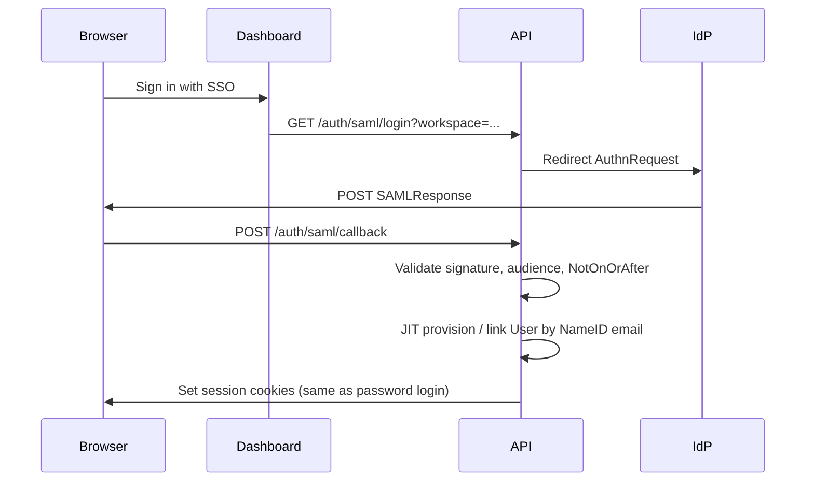

# SAML SSO & SCIM (architecture scaffold)

Enterprise customers often require **SAML 2.0 SSO** and **SCIM 2.0** provisioning. Project X private beta uses **email/password + JWT** today. This document describes the **target architecture** and config placeholders only — no IdP integration is implemented yet.

## Current state

- Authentication: short-lived JWT + refresh tokens; dashboard HttpOnly cookies ([security-baseline.md](./security-baseline.md)).
- Users live in Postgres `User`; workspace membership is separate.
- **No** SAML assertion consumer, **no** SCIM `/Users` endpoints.

## Target SAML flow (future)

**Design constraints:**

- Map SAML `NameID` (email) to existing `User.email` or create user + personal workspace via same path as register.
- Workspace-level SSO (one IdP per workspace) vs org-wide — prefer **workspace SSO policy** stored on `Workspace` when implemented.
- Fail-closed: invalid signature, skewed clock, or unknown issuer → 401, no session.
- Keep `sessionVersion` invalidation behavior identical to password auth.

## Target SCIM flow (future)

- SCIM bearer token per workspace (or global admin token rotated via secrets manager).
- Endpoints (scaffold): `GET/POST/PATCH/DELETE /scim/v2/Users`, group sync optional later.
- SCIM create → same provisioning as SAML JIT; deactivate → set membership inactive + revoke refresh tokens + bump `sessionVersion`.

## Environment placeholders

Optional env vars (parsed but **unused** until `apps/api/src/sso` is wired):

| Variable | Purpose |
| --- | --- |
| `SSO_ENABLED` | Feature flag (`false` default). |
| `SAML_ENTRY_POINT` | IdP SSO URL. |
| `SAML_ISSUER` | SP entity ID / issuer string. |
| `SAML_CALLBACK_URL` | ACS URL on API (e.g. `https://api.example.com/api/auth/saml/callback`). |
| `SAML_IDP_CERT` | IdP signing certificate (PEM). |
| `SCIM_BEARER_TOKEN` | Bearer token for SCIM clients (store in secrets manager). |

See root `.env.example` comments.

## Code scaffold

- Module stub: [apps/api/src/sso/README.md](../../apps/api/src/sso/README.md)
- Do **not** enable partial SAML in production without full signature validation and tests.

## Related

- [threat-model.md](./threat-model.md) — SSO moves trust boundary to IdP; SCIM increases provisioning abuse risk.
- [incident-response.md](./incident-response.md) — rotate `SCIM_BEARER_TOKEN` on compromise.
